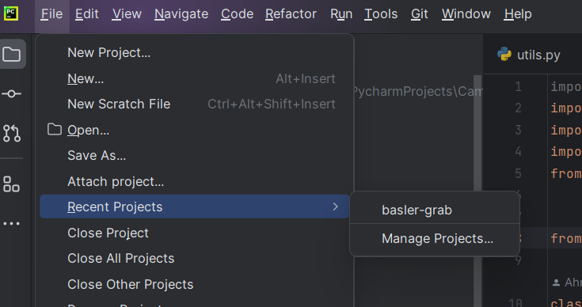
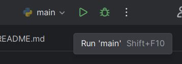
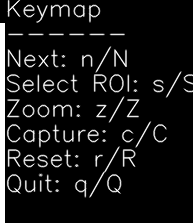

# Camera-Calibration & Basler-Grab Instructions

1. Open PyCharm

2.	Open 2 projects:
- Menu – Recent projects:
    - Camera-Calibration
    - basler-grab

    

3.	First run **Camera-Calibration**:
- for calibration you **turn on all the leds in main.py line 67**:
    ```sh
    _serial.write(data=b"A")
    ```
- main.py – Run

    

- then you can adjust the focus to your need

- use the indicated keymap to navigate the calibration panel

    

- press next (**n**) – then the exposure control algorythm is executed automatically and finishes by itself
- before you move on to using the basler-grab, make sure you **change the led settings** to have one led at a time turned on. You do this again in **main.py line 67**:
    ```sh
    _serial.write(data=b"1")
    ```

4. Now run **basler-grab**:
- the command to run the program:
    ```sh
    python basler_grab_png.py --ring-light-port=COM7 --verbose
    ```
- the above code is available in the program’s README file

- if the **COM7** doesn’t work, open up the **Device Manager** from the **Start menu** and search for **Ports (COM & LPT)** and you can access the port information
- the captured images will be saved in the project's sidebar **imgtest** folder
